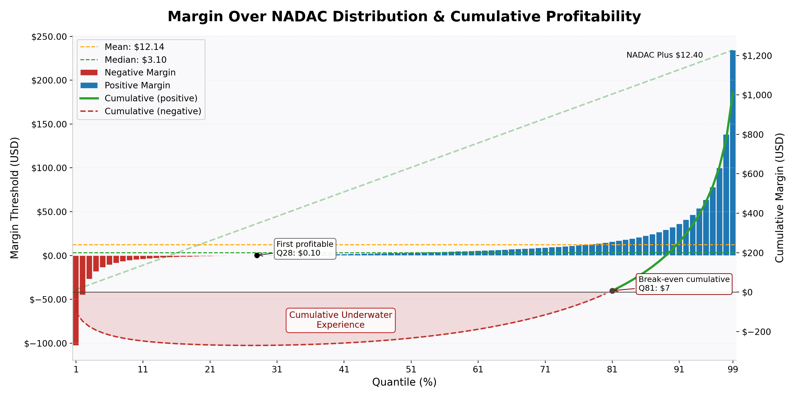
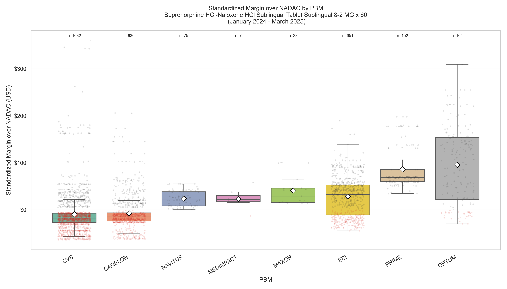

# Georgia NADAC Claims Data Processing

This project processes and analyzes Georgia pharmacy claims data, joining state claims, Medispan product info, and NADAC pricing to support regulatory reporting and transparency.

---

## Table of Contents

1. [GA NADAC Statute](#ga-nadac-statute)
2. [Rules and Regulations](#rules-and-regulations-of-the-state-of-georgia)
3. [Data Sources](#data-sources)
4. [Project Structure](#project-structure)
5. [Quickstart](#quickstart)
6. [Methods](#methods)
7. [Data Dictionaries](#data-dictionaries)
8. [License](#license)
9. [Contact](#contact)

---

## GA NADAC Statute

- [Official Statute Text](https://public.fastcase.com/jaEE2PXzRXmZ99jOLMt1IlPmSz6f3MMaCPT9G8hM0bm6V%2FY9m9m7K9vx4cva%2BwWVUWNe65Hsj6dGBwqxwwda%2FQ%3D%3D)

**§ 33-64-9.1. Reimbursement methodologies utilized by pharmacy benefits managers**

**Key Provisions:**

- **Filing Requirements:**  
    Pharmacy benefits managers (PBMs) must file their reimbursement methodologies with the Commissioner for use in determining maximum allowable cost appeals. Confidential methodologies are protected from public disclosure.

- **NADAC Reference:**  
    PBMs must use the National Average Drug Acquisition Cost (NADAC) as a reference for reimbursing pharmacies for drugs on the NADAC list.

- **Reporting:**  
    Every four months, PBMs must publish a report (available to the public for at least 24 months) listing:
    - All drugs reimbursed 10% below or above NADAC.
    - For each drug: dispensing month, quantity, reimbursement per unit, affiliate status of pharmacy, whether dispensed under a government health plan, and the average NADAC for the month.
    - Excludes drugs dispensed under 42 U.S.C. Section 256b.

---

## Rules and Regulations of the State of Georgia

- [Georgia Administrative Code 120-2-97](https://rules.sos.ga.gov/gac/120-2-97)

**Reporting Deadlines:**

- **NADAC Reports:**  
    - January–April: Due by June 15
    - May–August: Due by October 15
    - September–December: Due by February 15 (following year)

- **Website Domain Filing:**  
    - PBMs must file the public website domain for NADAC reports by March 1 each year.
    - Any domain changes must be reported within 14 calendar days.


## Data Sources

### Georgia NADAC Reportings
Below are links to Georgia NADAC (National Average Drug Acquisition Cost) data sources from various pharmacy benefit managers and organizations:

- [Express Scripts](https://www.express-scripts.com/legal/nadac/ga)
- [Caremark](https://urldefense.proofpoint.com/v2/url?u=https-3A__info.caremark.com_dig_nadac&d=DwMFAg&c=euGZstcaTDllvimEN8b7jXrwqOf-v5A_CdpgnVfiiMM&r=0VPQ4OCQ2nrF7crdO8Pw0q1gcGvXRpNqnJjBeIgWl7U&m=8mOdGLVjGkUNsd-DMswbFHl6xIqquRHbVMKNvLMtJ7Rbkcp5W6Rel2SksZJU2_DS&s=WRohC4WhJLxMcs5QnUfAQy5LgWNEfJqYdEx6uAvosMg&e=)
- [Maxor](https://vytlone.com/pharmacy-benefit-management/)
- [Medimpact](https://www.medimpact.com/state-regulatory-requirements)
- [Navitus](https://navitus.com/state-requirements/)
- [Optum](https://professionals.optumrx.com/landing/georgia.html)
- [Prime Therapeutics](https://www.primetherapeutics.com/drug-pricing-information)
- [SaveRx](https://claritysavers.savrx.com/?Link=transparency)
- [SmithRx](https://smithrx.com/state-specific-reports)
- [VerusRx](https://www.verus-rx.com/nadac-reports/)


### NADAC
Yearly files were downloaded from [Medicaid NADAC Datasets](https://data.medicaid.gov/datasets?fulltext=nadac).
The files were filtered for reporting where the `effective_date` is equal to the `as_of` date.


## Project Structure


```
config.py         # Configuration for file paths and constants
models.py         # Data models for StateFile, NadacTable, Medispan, BaseTable
requirements.txt  # Python dependencies
readme.md         # Project documentation
```

---

## Quickstart

1. Clone this repository and set up a Python 3.10+ virtual environment.
2. Install dependencies:

    ```powershell
    pip install -r requirements.txt
    ```

3. Place your data files in the appropriate directories as specified in `config.py`.

4. Run your analysis or processing scripts as needed (see project structure and documentation for details).

---

## Methods

1. Download files from the above links.
2. Extract and transform data into the StateFile model (see Data Dictionaries below).
3. Join Medispan data to provide product names and descriptions.
4. Add NADAC pricing based on the National Average Drug Acquisition Cost unit price of the last day of the dispensed month (GA reports the year and month of the dispensing date).
5. Calculate `nadac_total` as `unit_price * qty`.
6. Calculate `margin_over_nadac` as `total - nadac_total`.
7. The final output is a BaseTable model (see Data Dictionary) written to a parquet file encapsulated with the function `create_base_table`.

---
# Analysis

## Standardized Margin Analysis




*Figure: Distribution of margin over NADAC for Georgia pharmacy claims. This visualization helps identify the spread and outliers in reimbursement margins relative to NADAC pricing.*

The figure above was generated by first running the ETL pipeline to produce the BaseTable, then using the `get_all_margin_quantiles` function from `analysis.py` to compute quantiles of the `margin_over_nadac` field across all claims. The resulting distribution was visualized to highlight the range and outliers in reimbursement margins relative to NADAC pricing.

### Key findings (standardized margin analysis)

- The margin distribution is strongly right-skewed: the mean margin (≈ $12.14) is noticeably larger than the median (≈ $3.10), indicating a small number of very large positive-margin claims drive overall profitability.
- A substantial left-tail of negative margins exists (many claims below NADAC), producing a prolonged "underwater" cumulative experience before the positive tail covers losses.
- The first quantile at which individual claims become profitable (margin > $0) occurs near Q28 (≈ $0.10), while cumulative break-even (the quantile where cumulative margin becomes positive) is much later (roughly Q81, ≈ $7 in the figure). This shows that the majority of the early-quantile population still contributes net losses until high-margin claims accumulate.
- The top quantiles (right tail) account for most cumulative profit — a few large-margin claims disproportionately affect totals and the mean.

## Specific Drug Analysis
- **Buprenorphine HCl-Naloxone HCl Sublingual Tablet Sublingual 8-2 MG** is a key medication for opioid use disorder treatment. Ensuring patient access is critical for effective care and recovery. Variations in reimbursement (margins over NADAC) can influence provider behavior and potentially affect patient access, as financial incentives may impact dispensing practices and treatment continuity.

### Methods

1. Identified all claims for this drug within the dataset.
2. Calculated the unit margin for each prescription by dividing the claim's margin over NADAC by the quantity dispensed.
3. Determined the median quantity dispensed across all claims (60 tablets).
4. Standardized each observation by multiplying the unit margin by the median dispensed quantity (60), enabling comparison across claims with varying quantities.
5. Grouped standardized margins by PBM and visualized the distribution using a box plot to highlight differences in reimbursement practices.




### Key findings (product-level)

- PBM variation: PBMs differ materially in both central tendency and dispersion for standardized margin on this product — some (e.g., OPTUM, PRIME) show higher medians and much wider IQRs while others (e.g., CVS, CARELON) have medians below zero.
- Negative-median PBMs: CVS and CARELON display median standardized margins below NADAC, indicating typical claims under those PBMs are loss-making for this product.
- Wide dispersion and outliers: OPTUM and ESI exhibit large IQRs and long tails — these PBMs both produce many high-margin outliers and substantial variability in reimbursement.
- Sample sizes: PBM sample counts (annotated above boxes) vary widely; interpretation should weight PBM-specific medians by their underlying n.


## Data Dictionaries

### StateFile
| Field      | Type   | Description                                      |
|------------|--------|--------------------------------------------------|
| ndc        | str    | National Drug Code (identifier for the drug)      |
| dos        | date   | Date of service                                  |
| qty        | float  | Quantity dispensed                               |
| total      | float  | Total amount (e.g., cost or reimbursement)       |
| affiliate  | bool   | Indicates if the claim is for an affiliate       |
| source     | str    | Source of the data or claim                      |

### NadacTable
| Field          | Type   | Description                                      |
|----------------|--------|--------------------------------------------------|
| ndc            | str    | National Drug Code (identifier for the drug)      |
| unit_price     | float  | NADAC unit price for the drug                    |
| effective_date | date   | Date the NADAC price became effective            |
| as_of          | date   | Date the NADAC price was reported (as of)        |

### Medispan
| Field   | Type   | Description                                      |
|---------|--------|--------------------------------------------------|
| ndc     | str    | National Drug Code (identifier for the drug)      |
| product | str    | Product name or description from Medispan         |

### BaseTable
| Field             | Type   | Description                                                      |
|-------------------|--------|------------------------------------------------------------------|
| ndc               | str    | National Drug Code (identifier for the drug)                      |
| product           | str    | Product name or description                                      |
| dos               | date   | Date of service (dispensing date)                                |
| qty               | float  | Quantity dispensed                                               |
| total             | float  | Total amount (e.g., cost or reimbursement)                       |
| nadac_total       | float  | Total NADAC cost (unit price × quantity dispensed)               |
| margin_over_nadac | float  | Margin over NADAC (total - nadac_total)                          |
| affiliate         | bool   | Indicates if the claim is for an affiliate                       |
| source            | str    | Source of the data or claim                                      |
| effective_date    | date   | Date the NADAC price became effective (from NADAC table)         |

---

## License

This project is licensed under the MIT License. See [LICENSE](LICENSE) for details.

## Contact

For questions or contributions, please contact the project maintainer.
